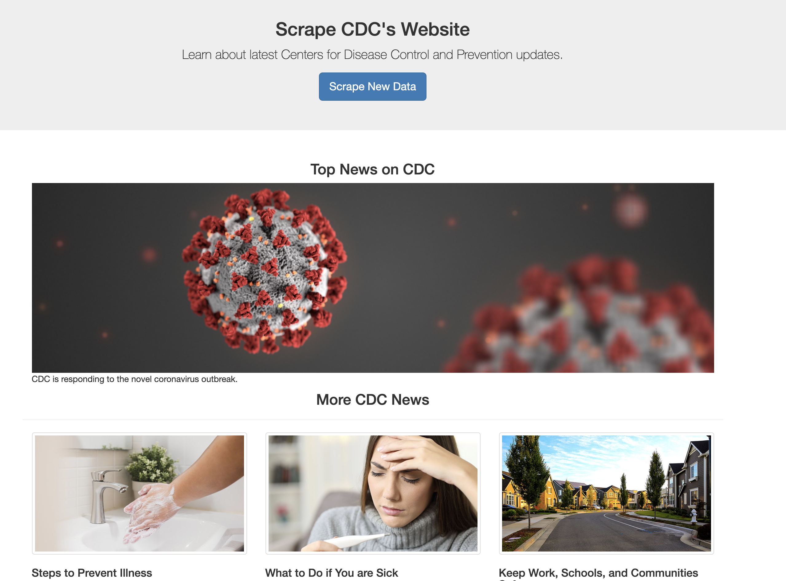

# cdc-scraper

Scrape CDC's Website -  Learn about the latest updates from Centers for Disease Control and Prevention.

Use Python Requests library, and BeautifulSoup to scrape CDC's website. 

Store scraped data in MongoDb, use PyMongo to create connaction in Flask.
